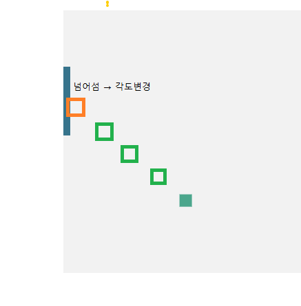

**자바스크립트 입문 도중 진행했던 토이프로젝트입니다. 코드 컨벤션이 지켜지지 않았고, 부족한 점이 많습니다. 본 프로젝트는, 이론보다는 실습으로 배우길 좋아하는 입문자의 자습 과정 정도로 봐주시면 감사하겠습니다.**

https://pjb6510.github.io/pong-game/pongGame.html

# pong-game


클래식 퐁 게임입니다. 퐁 게임 공은 원래 네모입니다. 그것이 레트로 감성이니까.(끄덕)

## 조작

- left player : W, S
- right player : (방향키) ↑ ↓

## 규칙

- 상대 진영으로 공을 넘겨, 상대가 공을 받아내지 못하게 하면 점수를 획득합니다.
- 공은 패들, 벽 등에 부딪치면 점점 빨라집니다.
- 공은 패들에 부딪칠 때, 부딪히는 패들의 위치에 따라 다음 각도가 결정됩니다.
- **공의 갯수가 점점 늘어납니다.** 어느 플레이어든 2점, 5점, 8점이 되면 2개, 3개, 4개로 늘어납니다.
- 총 12점을 얻으면 승리합니다.

## 이슈 기록

### 1. this 바인딩

requestAnimationFrame에 this가 바인딩 되지 않는 문제

```js
//1. use bind
requestAnimationFrame(this.renderLoop.bind(this));
//2. use new function
var self = this;
requestAnimationFrame(function () {
  self.renderLoop();
});
//3. use ES6
requestAnimationFrame(() => {
  this.renderLoop();
});

//4. bind function in constructor
function FFT() {
  //...
  this.renderLoop = this.renderLoop.bind(this);
}
```

출처 : https://www.html5gamedevs.com/topic/20251-using-a-non-global-function-as-requestanimationframe-callback/

### 2. 삼각함수

```js
getPosWidthAngle(angle) {
  // angle 계산 방향이 역방향이라 마이너스 처리.
  const xcos = Math.cos((Math.PI / 180) * -angle);
  const ysin = Math.sin((Math.PI / 180) * -angle);

  return {
    xcos,
    ysin,
  };
}
```

Math.cos와 Math.sin에 넣어주는 값은 라디안 단위(1PI = 180도)임을 명심할 것.

저렇게 나온 xcos랑 ysin을 speed와 곱해준 후 기존 좌표에 더해줄 것.

### 3. 잔상


분명히 clearRect를 정확한 수치로 해주었는데도 대각선 움직임에서는 이전 프레임에서 그려진 사각형이 제대로 지워지지 않았다. (0도 90도 등은 괜찮았는데...)

```js
ctx.clearRect(this.xPos - 1, this.yPos - 1, this.width + 2, this.height + 2);
```

이렇게 상하좌우로 1씩 여유롭게 clearRect를 해주니 해결되었다.

저 clearRect는 공에 해당하는 요소 뿐만 아니라 캔버스 위 다른 요소들도 지워버리니 충돌처리도 저 여유공간을 기준으로 해주지 않으면, 공과 다른 요소가 겹칠 때, 다른 요소가 공의 애니메이션에서 발생하는 clearRect때문에 지워질지도 모른다.


공을 받아보니 공을 받을때마다 패들이 지워진다.

특정 요소만 지우려면 캔버스를 두 겹 이상으로 겹친 다음, 레이어처럼 처리해야한다. 그냥 마음 편하게 공과 paddle 레이어를 구분했다.

### 4. 공의 충돌처리

#### 4-1. 충돌 시점 프레임 처리

```js
//in ball calss
horizontalBounce() {
  this.angle *= -1;
}

verticalBounce() {
  this.angle = 180 - this.angle;
}

if (this.yPos <= 0 || this.yPos + this.height >= CVS_HEIGHT) {
  this.horizontalBounce();
}

if (this.xPos <= leftPaddle.thickness || this.xPos + this.widt >= CVS_WIDTH - leftPaddle.thickness) {
  this.verticalBounce();
}
```

위 코드는 언뜻 잘 작동하는 것처럼 보이지만, 공이 우선 경계를 넘어간 후에 그 다음 애니메이션 처리부터 반사각이 적용되어 움직이기 시작한다. 애니메이션 프레임이 빠르게 지나가므로 눈에 잘 띄지는 않지만 엄밀하게 잡아주려면, 충돌되는 시점의 프레임(충돌 사물들이 딱 붙어있는 그림 한 장)을 따로 표시해주는 것이 맞다고 생각했다.

패들도 마찬가지로 맨 위랑 아래를 제대로 막아주려면, 다음 표시될 좌표를 가져와서 캔버스 경계를 넘어가는지 확인하고, 넘어가면 가장자리 끝에 딱 붙어있는 프레임 표시를 정확히 명시해줘야 한다고 생각했다.

```js
//in paddle class
moveUp() {
  if (this.yPos <= 0) {
    return;
  }

  this.clearPaddle();

  const nextYpos = this.yPos - this.speed;
  if (nextYpos <= 0) {
    this.setPaddleLocation(0);
  } else {
    this.setPaddleLocation(nextYpos);
  }
  this.drawPaddle();
  this.movingId = requestAnimationFrame(this.moveUp.bind(this));
}
```

```js
getTan(angle) {
  return Math.tan((Math.PI / 180) * angle);
}

hitHorizontalWall(nextXpos, nextYpos, topSideYpos, bottomSideYpos, leftSideXpos, rightSideXpos) {
  let restHeight;
  let restWidth;
  const tan = this.getTan(this.angle);

  // 블록 아랫면, 공 윗면 충돌처리.
  if (nextYpos <= bottomSideYpos) {
    restHeight = this.yPos - bottomSideYpos;
    this.setBallLocation(this.xPos + restHeight / tan, bottomSideYpos);
    // 밑변(x) = 높이 / tan
    this.horizontalBounce();
    return true;
  }

  //블록 윗면, 공 아랫면 충돌처리.
  else if (nextYpos + this.height >= topSideYpos) {
    restHeight = topSideYpos - (this.yPos + this.height);
    this.setBallLocation(this.xPos + restHeight / -tan, topSideYpos - this.height);
    this.horizontalBounce();
    return true;
  }

  // 블록 오른쪽면, 공 왼쪽면 충돌처리.
  else if (nextXpos <= rightSideXpos) {
    restWidth = this.xPos - rightSideXpos;
    this.setBallLocation(rightSideXpos, this.yPos + restWidth * tan);
    // 높이 = 밑변 * tan(angle)
    this.verticalBounce();
    return true;
  }

  // 블록 왼쪽면, 공 오른쪽면 충돌처리.
  else if (nextXpos + this.width >= leftSideXpos) {
    restWidth = leftSideXpos - (this.xPos + this.width);
    this.setBallLocation(leftSideXpos - this.width, this.yPos + restWidth * -tan);
    this.verticalBounce();
    return true;
  }

  return false;
}
```

공의 경우 paddle과 같은 1차원 움직임이 아니라 2차원 움직임이라서 각도에 따른 경계에 걸리는 좌표를 탄젠트로 계산해줘야한다.

#### 4-2. 빠른 속도로 인해 오브젝트 관통

위 코드는 다음 프레임에서 공이 있을 좌표가 특정 요소(패들이라던가 테두리 벽이라던가)와 부딪칠 상황이 되면, 그 부딪칠 좌표를 탄젠트로 계산해서 공을 그 부딪칠 좌표에 위치시킨 다음 각도를 바꾸어 진행시키는 코드다.

다음 프레임에서 공이 있을 좌표는 속도와 각도가 결정한다. 공의 속도는 다름 아니라 공의 프레임 간 위치 간격이다. 만약 속도가 너무 빨라서 즉 프레임 간 위치간격이 너무 커서 부딪칠 요소를 넘어선다면? 뚫고 지나간다.



정상작동


너무 빨라서 프레임간 공의 위치 간격이 너무 크면? 범위를 넘어서서 관통한다.

그래서 다음 프레임 좌표까지의 사이 좌표들을 속도1을 가정하여 리스트에 넣어서 계산값으로 각 메소드에 넘겨주기로 했다.

```js
let hitBallTop = false;
let hitBallBottom = false;
let hitBallLeft = false;
let hitBallRight = false;
for (let i = 0; i < posListBetweenNextPos.length; i++) {
  hitBallTop =
    posListBetweenNextPos[i].y <= bottomSideYpos && bottomSideYpos !== null;
  hitBallBottom =
    posListBetweenNextPos[i].y + this.height >= topSideYpos &&
    topSideYpos !== null;
  hitBallLeft =
    posListBetweenNextPos[i].x <= rightSideXpos && rightSideXpos !== null;
  hitBallRight =
    posListBetweenNextPos[i].x + this.width >= leftSideXpos &&
    leftSideXpos !== null;

  if (hitBallTop || hitBallBottom || hitBallLeft || hitBallRight) {
    break;
  }
}
```

벽 충돌처리 메소드에 넣어준 코드이다. posListBetweenNextPos 리스트는 현재 좌표부터 다음 이동 좌표까지 사이의 좌표들을 1픽셀 간격으로 갖고 있다. for문을 돌면서 하나라도 충족되는 조건이 있으면 충돌처리되도록 했다. 다른 모든 충돌처리도 같은 방식으로 하기로 했다.

### 5. 패들 앞면 / 옆면 처리

이 문제도 충돌처리와 관련 있다. 공과 패들의 앞면과 옆면(모서리)의 충돌처리를 어떻게든 따로 잘 구현하고싶었다.


한 3일을 고민해가며 코드를 계속 수정한 결과 최종적으로 이런 모양을 띠게되었다.

#### 5-1. x좌표 충돌 검사

공의 현재좌표부터 다음 이동좌표 사이의 좌표들 중 공이 패들을 바라보는 x좌표(왼쪽 패들이라면 공 왼쪽면, 오른쪽 패들이라면 공 오른쪽면)가 패들의 앞면 x좌표를 넘어서는지 검사한다. 만약 넘어서지 않는다면 공과 패들이 충돌할 여지가 아예 없다.

#### 5-2. y좌표 충돌 검사

공의 현재좌표부터 다음 이동좌표 사이의 좌표들 중 공의 아랫면이나 윗면이 패들의 y좌표 범위에 들어가는 좌표가 있는지 검사한다. 만약 넘어서지 않는다면 공과 패들이 충돌할 여지가 아예 없다.

#### 5-3. 앞면 충돌 검사


x, y좌표 검사를 모두 통과했다면 패들의 앞이든 옆이든 부딪치는건 확정이다. 우선 앞면 검사부터 한다. 현재 공의 각도의 탄젠트 값으로 패들의 앞면에 공이 도달했을 때의 y좌표를 구한다. (가상좌표) 만약 y좌표가 패들y범위에 있으면 앞면충돌처리를 한다. 아니라면 옆면 충돌 검사를 진행한다.

#### 5-4. 옆면 충돌 검사


x, y좌표 검사를 모두 통과했다면 패들의 앞이든 옆이든 부딪치는건 확정이다. 우선 앞면 검사부터 한다. 현재 공의 각도의 탄젠트 값으로 패들의 앞면에 공이 도달했을 때의 y좌표를 구한다. (가상좌표) 만약 y좌표가 패들y범위에 있으면 앞면충돌처리를 한다. 아니라면 옆면 충돌 검사를 진행한다.


옆면 충돌처리 전


옆면 충돌처리 후

### 6. 패들이 움직이면서 공과 충돌하면 충돌처리가 두 프레임 연속으로 일어남

공은 어느 요소에 맞아도 요소의 바깥으로 튕겨 나가기 때문에 연속으로 같은 오브젝트에 충돌하는 일은 일어나선 안 된다. 그래서 공 클래스에 마지막 히트 오브젝트를 속성값으로 넣어주고 같은 오브젝트에 중복으로 충돌처리가 이루어지려고 하면 return false; 하도록 코드를 추가했다.

### 7. 조작감

동시입력을 처리하지 않으니 정말 만지기 싫은 조작감이 나왔다.

눌린 키에 의해 명령을 수행 받되, 동시 입력이 있다면 항상 마지막으로 입력된 키에 의한 명령을 수행하는 방식으로 처리하였다.

- 키 배열을 만든다.
- 키가 눌릴 때, 키 배열에 입력한다.
- 키가 떼어질 때, 키 배열에서 제거한다.
- 키에 해당하는 액션은 항상 배열 마지막 키(가장 마지막에 입력된 키)를 기준으로 실행하며, 동시에 여러 액션이 실행되어선 안 된다.

### 8. 비동기

사실 여태껏 비동기를 다뤄본 적이 없어서 requestAnimationFrame을 다루는게 쉽지 않았다. 자꾸 함수가 실행되면 해당 함수가 끝날 때까지 다음 코드가 진행되지 않을거라는 무의식적인 생각 때문에 코드 진행 구조를 짤 때 꽤 애를 먹었다. 아래 글을 참고하자.

[[Javascript] 비동기 스케줄링과 Frame의 LifeCycle](https://iamsjy17.github.io/javascript/2019/07/20/how-to-works-js2.html)
